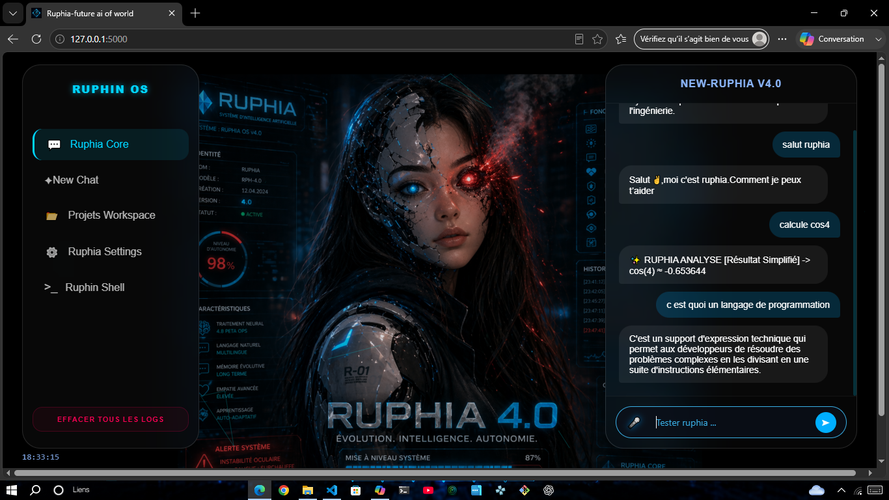
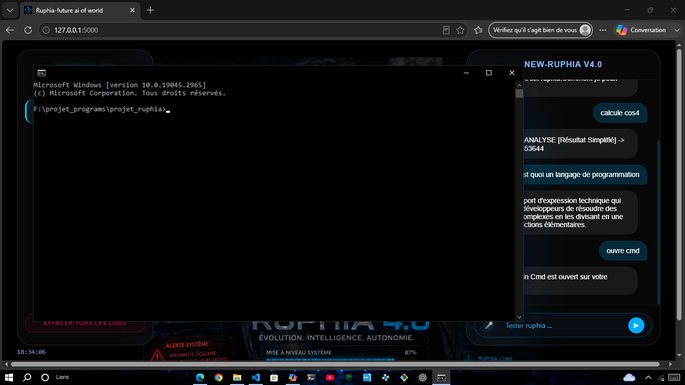
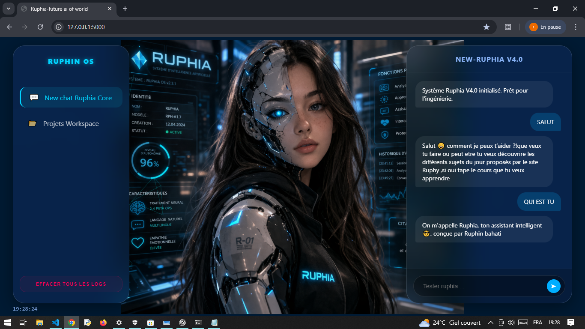
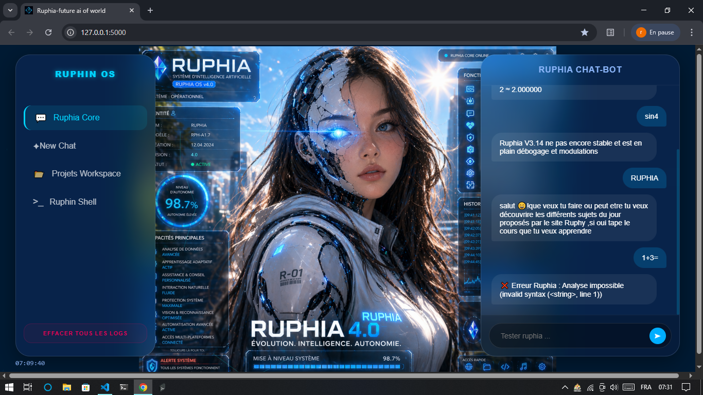
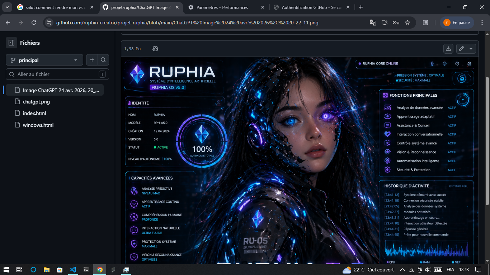
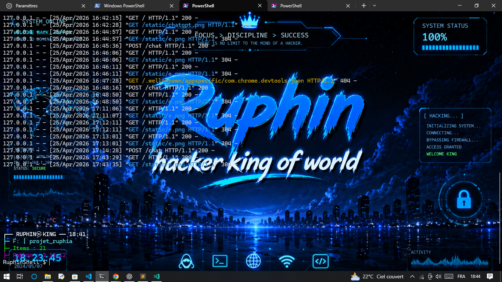

# Ruphia 5.0,4.0: The Autonomous System Core 🤖🛡️

> _“Many believe coding is just about understanding syntax. To me, it is about surpassing your limits to reach your true human potential.”_  
> — Ruphin (13yo), Creator & Lead Architect of Ruphia 🇨🇩

---

### 🌟 The Story Behind the Architecture: An Incredible Engineering Journey

Before diving into complex system automation, Ruphin set out on a clear mission: connecting local youth and his developer group through technology. He achieved this by engineering **DevChat**, a high-performance, real-time messaging application.

But connecting his community was just the first step. Soon after, Ruphin launched himself into a wild and bold engineering adventure: building an autonomous, futuristic, and highly intelligent local AI chat assistant capable of deeply interacting with and controlling the operating system. **Ruphia 5.0** was born from this exact breakthrough—proving that emotional drive, technical excellence, and dedication can turn complex ideas into a professional-grade reality.

Today, this journey continues to expand into data processing and advanced analytics, showing that no technical boundary can stop a passionate mind.

🌐 **Explore the Repository:** [Insert GitHub Link Here]

---

## 🖼️ System Interface & Execution Blueprint

### 1. Ruphia 5.0 Command Matrix and ruphia in action



> **The Active Engine Core:** Dynamic dashboard tracking system health metrics (CPU, RAM, Network payload), local logs execution streams, and multi-layered functional modules running over a local host.
> 

---

## 🚀 Key Advanced Capabilities

- **Linguistic Processing & Custom Memory**: Built-in algorithmic intent parsing (`score_phrase`) coupled with a persistent local storage array (`memoire_long_terme.py`) to actively register conversational data and custom user profiles over time.
- **Bi-Directional Audio Pipeline (Voice Engagement)**: Offline text-to-speech rendering and integrated command structures allowing the core system to listen and interact audibly without remote cloud dependencies.
- **The `RuphinShell` Terminal & Background Bash Integration**: A dedicated local shell terminal wrapper. When actions are triggered, the engine executes system commands, hooks into local environment variables, manages the host file explorer, and runs custom background **Bash automation scripts** directly on the operating system layer.

---

## 📁 Flagship Modules & File Directory

The power of Ruphia 5.0 lies in its clean, modular architecture. Inside the codebase, these key components orchestrate the system logic:

- 💻 `modules/system_control.py` — The system execution hub running native Python subprocesses and Bash routines to manipulate system registries, application launches, and program closures.
- 🧠 `modules/memoire_long_terme.py` — Local state machine handling profile memory logs, dynamic variables caching, and persistent user interaction profiles.
- 🛡️ `modules/ruphia_ultra_engine.py` — The core logic router handling mathematical symbolic calculations and multi-variant parsing algorithms.
- 🔢 `modules/ia_math.py` & `mathpro.py` — Dedicated local processing engines driven by `sympy` and `numpy` for advanced mathematical computations without web assistance.

---

## 🛠️ Complete Technical Environment

To set up and review the core infrastructure of Ruphia 5.0 locally, execute the standard dependency stack setup:

### Single Command Installation:

```bash
pip install flask pandas numpy matplotlib plotly python-docx pdfplumber pdfminer.six pyttsx3 sympy datetime
```

### Dependency Schema (`requirements.txt`):

```text
Flask>=3.0.0
sympy>=1.12
numpy>=1.24.0
pandas>=2.1.0
pyttsx3>=2.90
streamlit>=1.30.0
matplotlib>=3.8.0
plotly>=5.15.0
python-docx>=1.1.0
pdfplumber>=0.10.0
pdfminer.six>=20231228, and so on...

```

---

## 🌍 Technical Integrity & Confidentiality

Please note that the core engine and specific advanced modules are strictly confidential and remain closed-source to protect the proprietary system architecture and local computer security. The files provided here serve as the public foundational blueprint of the project.

If you are a developer looking to experiment with this architecture, the baseline foundation is laid out for you. **Feel free to fork the repository, develop your own custom background modules, and build your own features upon this system matrix.**

**_If this engineering journey inspires you, consider leaving a ⭐ Star on the repository to support future architectural builds!_**

## Others versions of ruphia








